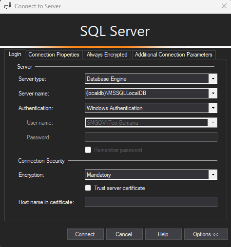

# Orchard 2.1.7 Local Environment Setup on Windows - NuGet-based - No Admin Privilege

- This guide provides step-by-step instructions to set up a local development environment for Orchard 2.1.7 on a Windows system using NuGet Packages. Note that while the software can be installed without admin privileges, certain steps may require admin access.

### Development guidelines
- The main branch of the repository is the `dev` branch. Always start your development branch from there and open your pull requests targeting this branch, unless instructed otherwise (e.g., it's part of a larger feature development).
- For smaller developments and bugfixes the branch name should be `issue/<issue-code>` (for Lombiq-developers, e.g. `issue/SANTA-123`) or `issue/<short-description>` (e.g., `issue/adding-sponsors-widget`).
- For a large features (that involves through testing and involves other "issue branches") the branch name should be `feature/<short-description>` (e.g., `feature/upgrade-to-1-8`).
- Force push is disabled.

### Sections
1. [Prerequisite Software](#1-install-prerequisite-software)
2. [Tested Environment](#tested-environment)
2. [Verify Installed Versions](#2-verify-installed-versions)
3. [Building and Running the Solution](#3-building-and-running-the-solution)

### 1. Prerequisite Software
- [Microsoft Visual Studio 2022](...)
- [Git for Windows < v.?](https://gitforwindows.org/)
- [.NET SDK < v8.0](https://dotnet.microsoft.com/en-us/download)
- [Node Version Manager (NVM) for Windows < v1.2.2](https://github.com/coreybutler/nvm-windows/releases)
  - node.js < v? (installed via NVM)
  - npm < v? (installed via NVM)
  - pnpm < v? (installed via Corepack)

### 2. Tested Environment
The current setup versions have been used to develop and test the project successfully.
- Microsoft Visual Studio 2022 v17.14.7
- .NET SDK `v9.0.301`
- NVM `1.2.2`
  - Node.js `v14.17.0` (installed via NVM)
  - NPM `v6.14.16` (installed via NVM)
  - PNPM `v7.15.0` (installed via Corepack with NVM)

### 3. Installation Steps
- Download and install git for Windows from [git](https://gitforwindows.org/).
  <br><br>
- Download and install .NET SDK `< v8.0` from [dotnet-sdk.exe](https://dotnet.microsoft.com/en-us/download).
<br><br>
- Before installing nvm, ensure there are no existing Node.js or npm installations on your system . If you previously installed Node.js (especially in C:\Program Files), uninstall it and remove any related paths from your system environment variables to avoid conflicts.
- Download and install`nvm-setup.exe` (Node Version Manager) from [nvm-windows releases](https://github.com/coreybutler/nvm-windows/releases).
- Execute the `nvm-setup.exe` installer [^1]
  - License Agreement: Accept the license agreement and click `Next`.[^admin]
  - Select Destination Location: **Important** select the installation path as `C:\Users\$User\AppData\Roaming\nvm` (where `$User` is your Windows username). This is crucial for the correct functioning of NVM.
  - Active Version Location: Leave the symlink path as default `C:\nvm4w\nodejs`
  - Desktop Notification: Select whether you want a desktop notifications or not, this is optional, it won't affect the installation.
  - Author Progress Email: You can leave this field empty or fill it with your email address, this is optional, it won't affect the installation.
  - Ready to Install: Review your settings and click `Install` to proceed with the installation.
  - Completion: Once the installation is complete, click `Finish` and open a new terminal to verify the installation to confirm the version of NVM installed.
    - It's important to open a new command prompt (cmd) or PowerShell window to ensure the environment variables are updated.
    ```bash
      nvm version
    ```
  
- Install node.js, npm and pnpm using NVM.
  - In a command prompt (cmd) run the following command to install node.js and npm. This will download and install the latest LTS version of Node.js.
    ```bash
    nvm install lts
    ```
  -  After the lts installation is complete, use the following command to set the installed version as the active version:
    ```bash
    nvm use lts
    ```
  - Open a new bash terminal  to ensure the environment variables are updated. Avoid using a shell terminal on this step since npm commands might not be supported in shell. And verify the installation by 
  confirming the versions of Node.js and npm:
    ```bash
    node -v
    ```
    ```bash
    npm -v
    ```
  - If npm is not installed automatically, you can install it by running:
    ```bash
    nvm install-latest-npm
    ```
  - Now enable PNPM by Corepack running the following command. PNPM is triggered by Corepack in every build process, so it needs to be prepared and activated.
     ```bash
     corepack enable && corepack prepare pnpm@latest --activate
     ```
  - Verify the PNPM installation by running:
    ```bash
    pnpm -v
     ```

## 3.Setting the Database
- This setup is based on Visual Studio 2022 and aims to use SQL Server Object Explorer for database management.
- Go to `View` > `SQL Server Object Explorer` in Visual Studio.
- ### Option 1: Using the default Orchard Core Credentials for admin access
  - The repository is configured to automatically map to a local SQL Server instance through the `appsettings.Development.json` file.
  - In your local environment, ensure you have SQL Server Management Studio (SSMS) or any other SQL client installed.
    Open SSMS and connect to your local SQL Server instance using the following credentials, after it press `Connect`:
    - `Server Type:` Database Engine
    - `Server Name:`(localdb)\MSSQLLocalDB
    - `Authentication:` Windows Authentication`

    <br><br><br>

    
    - Once connected, create a new database named `santamonica.gov`(See Iron Mountain ScreenShots for naming conventions).

- ### Option 2: Using the Orchard Core Setup Database
  - Delete the `appsettings.Development.json` file in the `src/Orchard.Web` directory. This will force the application to use the default Orchard Core setup database.

## 4. Cloning, Building and Running the Project
- ### Cloning
  - Start cloning santamonica.gov.core Github repository to your local environment. From santamonica.gov.core repository,
    select `<> Code` dropdown and copy the HTTPS URL address. In your local environment, open a command prompt in the directory
    where you want to clone the repository and run the following command:
```bash
git clone https://github.com/CityofSantaMonica/santamonica.gov.core.git
```

- ### Building and Running
  -   ### Option 1: Build using VS IDE
- Open Visual Studio start window, under Get started select Clone a repository. Paste the previously copied git location under Repository Location field. Specify a path and then click on Clone.
- Navigate to the parent directory of the project and build/run it. The application will be hosted on:
  - `https://localhost:44300`
  - `http://localhost:8080`

### Option 2: Build using CLI
- Navigate to the parent directory of the project. And run the following command:
  ```bash
  dotnet run --project src/Orchard.Web/Orchard.Web.csproj
  ```
- The application will be hosted on:
  - `https://localhost:5000`
  - `http://localhost:5001`

*Notes*: 
- PNPM is triggered by Corepack during every build. 
  - PNPM is a package manager that helps manage project dependencies efficiently.
  - Corepack is a tool that allows you to use package managers like PNPM, Yarn, and NPM without needing to install them globally.
- NVM allows you to manage multiple Node.js, npm, and PNPM versions on your system.
  - If you need to switch Node.js versions in the future, you can use `nvm use <version>`.
  - ** This step requires admin privileges
  
[^1]: This step requires admin privileges
[^admin]: This step requires **admin privileges**.