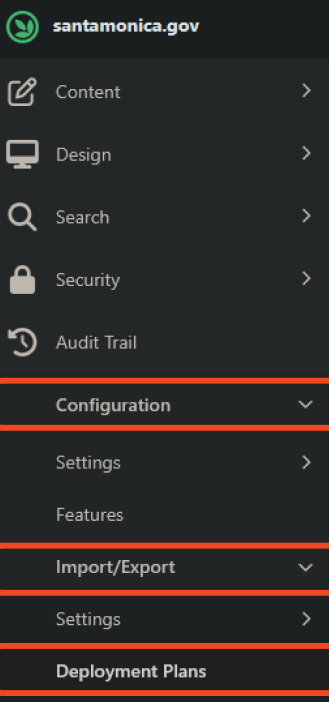

# Orchard 2.1.7 Local Environment Setup on Windows - NuGet-based - No Admin Privilege

- This guide provides step-by-step instructions to set up a local development environment for Orchard 2.1.7 on a Windows system using NuGet Packages. Note that while the software can be installed without admin privileges, certain steps may require admin access.

### Development guidelines
- The main branch of the repository is the `dev` branch. Always start your development branch from there and open your pull requests targeting this branch, unless instructed otherwise (e.g., it's part of a larger feature development).
- For smaller developments and bugfixes the branch name should be `issue/<issue-code>` (for Lombiq-developers, e.g. `issue/SANTA-123`) or `issue/<short-description>` (e.g., `issue/adding-sponsors-widget`).
- For a large features (that involves through testing and involves other "issue branches") the branch name should be `feature/<short-description>` (e.g., `feature/upgrade-to-1-8`).
- Force push is disabled.

### Sections
1. [Prerequisite Software](#1-install-prerequisite-software)
2. [Tested Environment](#tested-environment)
2. [Verify Installed Versions](#2-verify-installed-versions)
3. [Building and Running the Solution](#3-building-and-running-the-solution)

### 1. Prerequisite Software
- [Microsoft Visual Studio 2022](...)
- [Git for Windows < v.?](https://gitforwindows.org/)
- [.NET SDK < v8.0](https://dotnet.microsoft.com/en-us/download)
- [Node Version Manager (NVM) for Windows < v1.2.2](https://github.com/coreybutler/nvm-windows/releases)
  - node.js < v? (installed via NVM)
  - npm < v? (installed via NVM)
  - pnpm < v? (installed via Corepack)

### 2. Tested Environment
The current setup versions have been used to develop and test the project successfully.
- Microsoft Visual Studio 2022 v17.14.7
- .NET SDK `v9.0.301`
- NVM `1.2.2`
  - Node.js `v14.17.0` (installed via NVM)
  - NPM `v6.14.16` (installed via NVM)
  - PNPM `v7.15.0` (installed via Corepack with NVM)

### 3. Installation Steps
- Download and install git for Windows from [git](https://gitforwindows.org/).
  <br><br>
- Download and install .NET SDK `< v8.0` from [dotnet-sdk.exe](https://dotnet.microsoft.com/en-us/download).
<br><br>
- Before installing nvm, ensure there are no existing Node.js or npm installations on your system . If you previously installed Node.js (especially in C:\Program Files), uninstall it and remove any related paths from your system environment variables to avoid conflicts.
- Download and install`nvm-setup.exe` (Node Version Manager) from [nvm-windows releases](https://github.com/coreybutler/nvm-windows/releases).
  - Execute the `nvm-setup.exe` installer. [^1]
  - **License Agreement:** Accept the license agreement and click `Next`.
  - **Select Destination Location:** Select the installation path as `C:\Users\$User\AppData\Roaming\nvm` (where `$User` is your non-admin Windows username). 
    - **Do not use the admin user's AppData folder, as this will cause permission issues.** 
  - **Active Version Location:** Leave the symlink path as default `C:\nvm4w\nodejs`.
  - **Desktop Notification:** Select whether you want a desktop notifications or not, this is optional, it won't affect the installation.
  - **Author Progress Email:** You can leave this field empty or fill it with your email address, this is optional, it won't affect the installation.
  - **Ready to Install:** Verify your destination path is pointing to `C:\Users\$User\AppData\Roaming\nvm` and click `Install`.
    - **Do not use the admin user's AppData folder, as this will cause permission issues.**
  - **Completion:** Once the installation is complete, unselect the "Open with Powershell" checkbox, as this will open a PowerShell window with admin privileges, which is not what we're looking for this setup. Click `Finish` to complete the installation.
  - Restart your computer to ensure the environment variables are updated otherwise environment variables won't be recognized in your non-admin user account.
  - After the reboot, open a new command prompt or PowerShell window as a non-admin user and run the following command to verify the installation:
     ```bash
       nvm version
     ```
- Install node.js, npm and pnpm using NVM.
  - In a non-admin command prompt (cmd) run the following command to install the latest LTS version of node.js and npm.
    ```bash
    nvm install lts
    ```
  -  After the lts installation is complete, use the following command to set the installed version as the active version:[^1]
    ```bash
    nvm use lts
    ```
  - At this point, Node.js, npm, pnpm should be installed. You can verify the installation by running the following commands in a command prompt (cmd) terminal, avoid using PowerShell for this step since running `nvm` commands are disabled in PowerShell due to a organization policy.
    ```bash
    node -v
    ```
    ```bash
    npm -v
    ```
    - If npm is not installed automatically, you can install it by running:
      ```bash
      nvm install-latest-npm
      ```
  - Now enable PNPM by Corepack running the following command. PNPM is triggered by Corepack in every build process, so it needs to be prepared and activated.
     ```bash
     corepack enable && corepack prepare pnpm@latest --activate
     ```
  - Verify the PNPM installation by running:
    ```bash
    pnpm -v
     ```

## 3. Exporting Production Data
- To simulate production data, start exporting the deployment packages from the production environment going to the `https://santamonica.gov/admin` website, modules > `Configuration > Import/Export` > `Deployment Plan`. 

<br>

- Start downloading the `All Feaures` package, click on `Manage Steps` > `Execute` > `Select`. Execute the same steps for the following 26 deployment plans:

      All Taxonomies
      Blog Posts
      CKAN KPIs
      ContactInformationWidget
      Cultural Venue
      Data Definitions
      Deployment Plans
      Elections
      Events 
      Features
      Filtered List Headers
      Local Business
      Local Business Categories
      Menu's
      News Author
      Pages
      Parking Lots
      Places
      Press Releases
      Process Explainers
      Profiles
      Programs
      Promotions
      Recent Published Local Business
      Topic Explainers

- ### Cloning
  - Now it's time to clone the santamonica.gov.core repository in our local environment. Having git installed, run the following command.
  ```bash
  git clone https://github.com/CityofSantaMonica/santamonica.gov.core.git
  ```
- Open Visual Studio 2022 and click on `Open a project or new folder`. Navigate where you cloned the repository and select the folder to open the project.
- Before building the project, let's verify the database connection and ensure the database is set up correctly. For this documentation, we have used the MySQL Server LocalDB approach.
- Open the file `src/Orchard.Web/appsettings.Development.json` in Visual Studio. 
  - This file contains the auto setup database connection step for the local development environment 
  - This file also contains the database credentials for the admin user that will be later used to log in to the admin panel of the application to import the production data.
- Within the file, look for the `DatabaseProvider` key and ensure it is set to `SqlServer`. This indicates that the project is configured to use SQL Server as the database provider. Orchard supports database providers like `MySql`, `PostgreSql`, or `Sqlite` by changing the value of this key accordingly.
- By default, the `DatabaseProvider` key is set to use SQL Server LocalDB. Knowing that, we can proceed to build and run the project.
- Open a terminal within Visual Studio or use a command prompt (cmd) in the project directory and run the following command to restore the NuGet packages:
  - Don't run this command in PowerShell, as pnpm is not supported in PowerShell due to an organization policy.
  
    ```bash
    dotnet run --project src/Orchard.Web/Orchard.Web.csproj
    ```
 
- The application will be hosted on:
  - `http://localhost:8080`
  - `https://localhost:44300`
  
- ### Preview data using SQL Server Object Explorer
- To preview the data in the database, you can use SQL Server Object Explorer in Visual Studio. Follow these steps:
- Open Visual Studio and go to `View > SQL Server Object Explorer`.
- In the SQL Server Object Explorer, right-click on `SQL Server` and select `Add SQL Server`.
- In the `Connect to Server` dialog, enter the following details:
- `Server Name:` `(localdb)\MSSQLLocalDB`
- `Authentication:` `Windows Authentication`
- Click `Connect`.
- Once connected, you should see the SQL Server LocalDB instance in the SQL Server Object Explorer. You can expand the `Databases` node to see the databases available on your local instance.

    <br><br><br>
*Notes*: 
- PNPM is triggered by Corepack during every build. 
  - PNPM is a package manager that helps manage project dependencies efficiently.
  - Corepack is a tool that allows you to use package managers like PNPM, Yarn, and NPM without needing to install them globally.
- NVM allows you to manage multiple Node.js, npm, and PNPM versions on your system.
  - If you need to switch Node.js versions in the future, you can use `nvm use <version>`.

[^1]: This step requires admin privileges